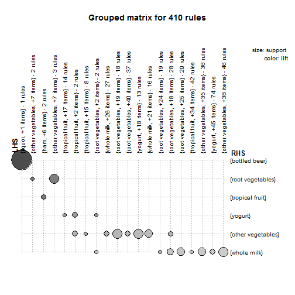

## Objective

Introduce **apriori algorithm** as a potential technique to suggest the Next Best Offer
for a client.

Note: It will be presented just an initial analysis for Course purposes.

--- .class #id 

## Apriori algorithm

Apriori is an an algorithm for frequent item set mining and association rule learning over transactional databases.
Baically it learns through sequence of transactions how products are linked each other.
apriori calculates 3 indicators to present rules:
- ***Support*** --> frequency of how many times a certain rule is found
  - Eg _{cheese}_ appears in 1% of the whole dataset or _{cheese, bread}_ appears 0.1%

- **Confidence** --> Conditional probability of a certain rule is found in a group of 
  - Eg: _{cheese}_ appears in 25% of the dataset _{cheese, bread}_

- **Lift** --> Examinates the independence level of a certain rule: If lift = 1, then variables are independent
  - Eg: _{cheese, bread}_ appears in 0.1% of the dataset _{cheese, bread}_

---
## Output


```
##    lhs                         rhs                    support confidence      lift
## 1  {liquor,                                                                       
##     red/blush wine}         => {bottled beer}     0.001931876  0.9047619 11.235269
## 2  {curd,                                                                         
##     cereals}                => {whole milk}       0.001016777  0.9090909  3.557863
## 3  {yogurt,                                                                       
##     cereals}                => {whole milk}       0.001728521  0.8095238  3.168192
## 4  {butter,                                                                       
##     jam}                    => {whole milk}       0.001016777  0.8333333  3.261374
## 5  {soups,                                                                        
##     bottled beer}           => {whole milk}       0.001118454  0.9166667  3.587512
## 6  {napkins,                                                                      
##     house keeping products} => {whole milk}       0.001321810  0.8125000  3.179840
## 7  {whipped/sour cream,                                                           
##     house keeping products} => {whole milk}       0.001220132  0.9230769  3.612599
## 8  {pastry,                                                                       
##     sweet spreads}          => {whole milk}       0.001016777  0.9090909  3.557863
## 9  {turkey,                                                                       
##     curd}                   => {other vegetables} 0.001220132  0.8000000  4.134524
## 10 {rice,                                                                         
##     sugar}                  => {whole milk}       0.001220132  1.0000000  3.913649
```

---

## Plotting rules


 

---

## Analysis


By the data shown on previous slide, we can assume that 90% of people who buy {liquor}
and {red/blush wine}, also would buy a {bottled beer}, indicating the possible Next Best Offer for this specific transaction.
See at the plot, in the first row the size of the circle, presenting a high relation
between these products.
